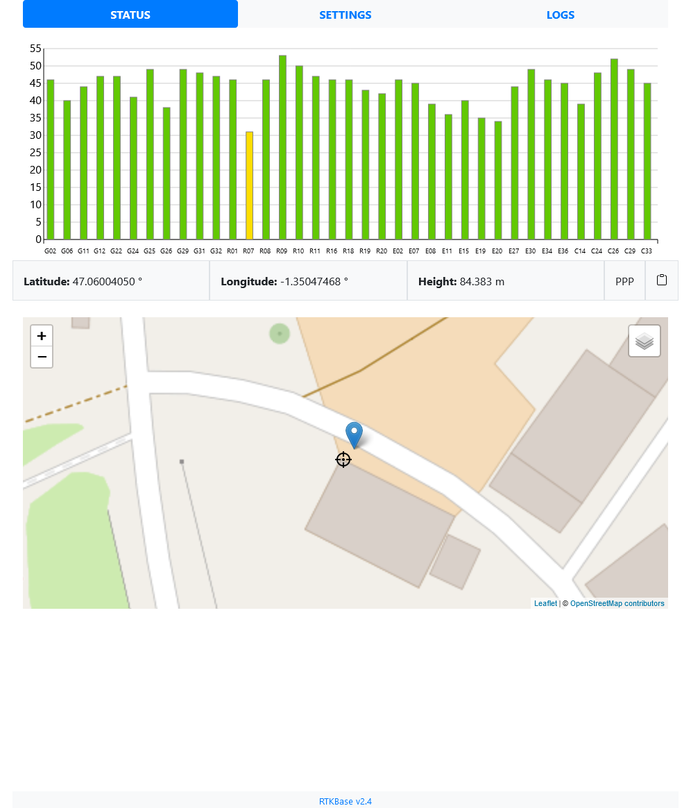
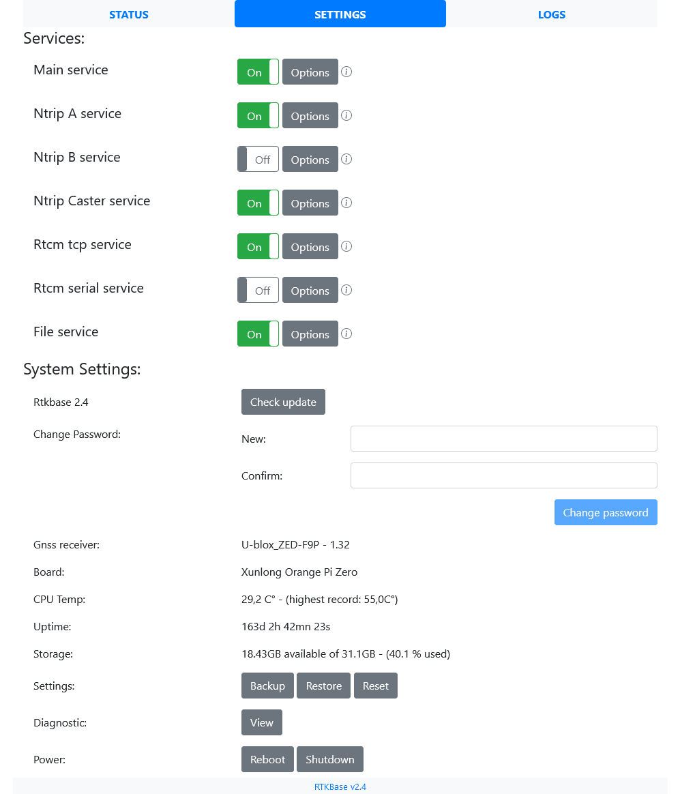
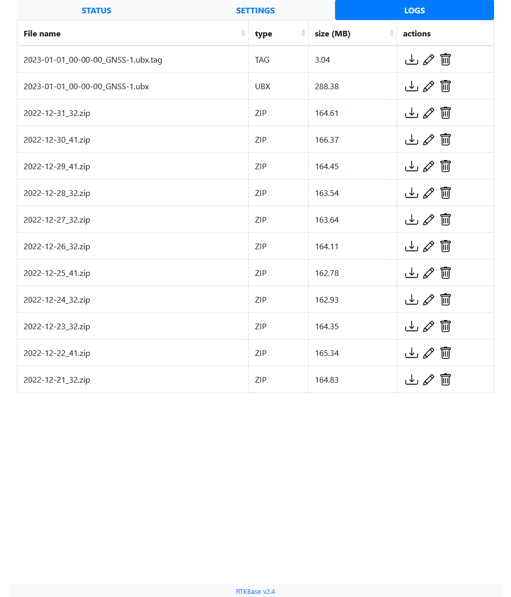
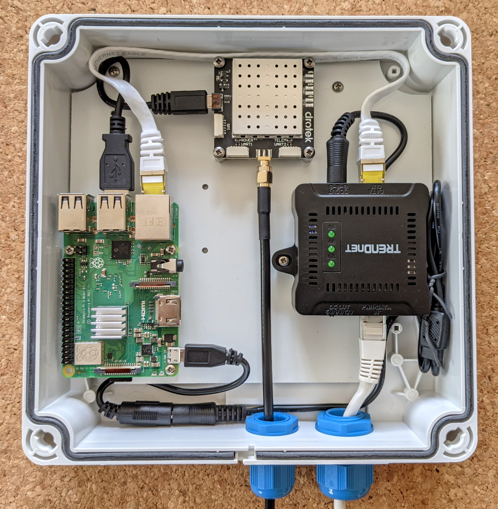
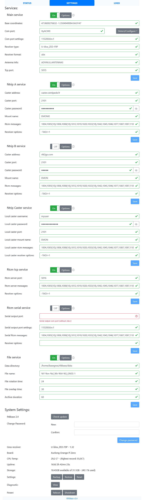
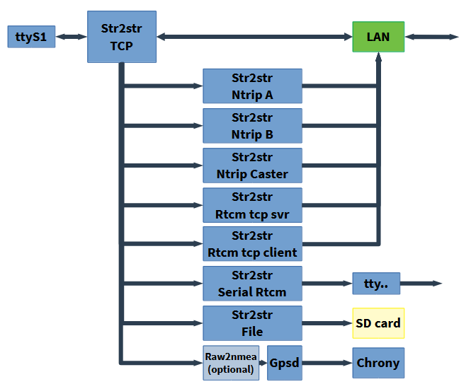
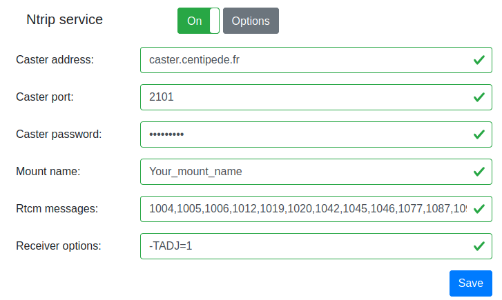

# Crear una base de RTKBase

### Una interfaz web fácil de usar y de instalar, con scripts bash y servicios para una sencilla estación base GNSS sin cabeza.

## FrontEnd:
<p align="center">
|||</p>|

Las principales funciones del frontend son:

+ Visualizar los niveles de señal de los satélites
+ Visualizar la ubicación de la base en un mapa
+ Detectar y configurar el receptor GNSS (Ublox F9P, Septentrio Mosaic-X5, Unicore UM980 / UM982)
+ Iniciar/detener varios servicios (Envío de datos a un transmisor Ntrip, transmisor Ntrip interno, servidor Rtcm, Envío de flujo Rtcm en un enlace de radio, Registro de datos sin procesar en archivos)
+ Editar la configuración de los servicios
+ Convertir datos sin procesar a Rinex
+ Descargar/eliminar datos sin procesar

## Ejemplo de como quedaria la Base:
<p align="center"></p>

+ Carcasa: GentleBOX JE-200 (impermeable, con prensaestopas para antena y cable Ethernet)
+ SBC: Minimo Raspberry Pi 3 / Orange Pi Zero (512 MB)
+ Receptor GNSS: Ardusimple con chip U-Blox ZED-F9P, Mosaic-X5 (de Drotek)
+ Antena: DA910 (Gps L1/L2, Glonass L1/L2, Beidou B1/B2/B3 y Galileo E1/E5b/E6) + cable exterior SMA (macho) a TNC (macho).
+ Alimentación: Directa de una bateria de 12v con conversor a 5v para alimentar la electronica, o una opcion de Inyector POE+ Trendnet TPE-115GI + Extractor/Divisor POE Trendnet TPE-104GS + Adaptador de CC de barril a micro USB
+ Bateria de alimentacion de 12v
+ Router Wifi para dar cobertura a los Rovers o dispositivos que necesiten NTRIP.
+ En zonas donde puedas montar antenas direccionales de alta ganancia, una red Wi‑Fi punto a punto o en malla (por ejemplo, Ubiquiti airMAX) puede ofrecer decenas de Mbps a 10–20 km. Usa WPA2 y enruta UDP con los flujos RTCM.

Más imágenes disponibles en la carpeta ./images

## Versión ISO lista para flashear:
Hay una imagen lista para flashear disponible para Orange Pi Zero, Orange Pi Zero 2 y Orange Pi Zero 3 SBC: [Armbian_RTKBase](https://github.com/Stefal/build/releases/latest)

Si usamos una Raspberry Pi, gracias a [jancelin](https://github.com/jancelin), puedes descargar un archivo ISO listo para flashear [aquí](https://github.com/jancelin/pi-gen/releases/latest).

## Instalación sencilla:
+ Conecta tu receptor GNSS a tu Raspberry Pi / Orange Pi / ...

+ Abre una terminal y:

```bash
cd ~
wget https://raw.githubusercontent.com/Stefal/rtkbase/master/tools/install.sh -O install.sh
chmod +x install.sh
sudo ./install.sh --all release
```

+ Ve a tomar un café, que tardará un poco. El script instalará el software necesario y, si usas un receptor compatible (U-Blox ZED-F9P, Septentrio Mosaic-X5, Unicore UM980/UM982), lo detectará y lo configurará para funcionar como estación base. Si no usas un receptor compatible, tendrás que configurarlo manualmente (consulta el paso 7 de la instalación manual) y elegir el puerto correcto en la página de configuración.

Abra un navegador web en `http://ip_de_su_sbc` (el script intentará mostrarle esta dirección IP). La contraseña predeterminada es `admin`. La página de configuración te permite introducir tus propios ajustes para las coordenadas de la base, las credenciales de NTRIP, etc.



Si aún no conoces las coordenadas precisas de tu base, es hora de leer uno de estos tutoriales:

- [rtklibexplorer - Postprocesamiento RTK - para receptores de una y dos frecuencias](https://rtklibexplorer.wordpress.com/2020/02/05/rtklib-tips-for-using-a-cors-station-as-base/)
- [rtklibexplorer - PPP - para receptores de dos frecuencias](https://rtklibexplorer.wordpress.com/2017/11/23/ppp-solutions-with-the-swiftnav-piksi-multi/)
- [Documentación de Centipede (en (francés)](https://docs.centipede.fr/docs/base/positionnement.html)

+ Para encontrar su dirección IP base, puede usar la sencilla herramienta de interfaz gráfica de usuario `find_rtkase`. Está disponible para GNU/Linux y Windows en [./tools/find_rtkbase/dist](./tools/find_rtkbase/dist/).

- Haga clic en el botón "Buscar", espere y luego haga clic en el botón "Abrir". Se abrirá la interfaz gráfica de usuario de RTKBase en su navegador web.

<p align="center">

</p>

## Instalacion de modo Manual:
El script `install.sh` se puede utilizar sin la opción `--all` para dividir el proceso de instalación en varios pasos diferentes:

```
    ################################
    RTKBASE INSTALLATION HELP
    ################################
    Bash scripts to install a simple gnss base station with a web frontend.
    
    
    
    * Before install, connect your gnss receiver to raspberry pi/orange pi/.... with usb or uart.
    * Running install script with sudo
    
    Easy installation: sudo ./install.sh --all release
    
    Options:
            -a | --all <rtkbase source>
                             Install all you need to run RTKBase : dependencies, RTKlib, last release of Rtkbase, services,
                             crontab jobs, detect your GNSS receiver and configure it.
                             <rtkbase source> could be:
                                 release  (get the latest available release)
                                 repo     (you need to add the --rtkbase-repo argument with a branch name)
                                 url      (you need to add the --rtkbase-custom-source argument with an url)
                                 bundled  (available if the rtkbase archive is bundled with the install script)
    
            -u | --user
                             Use this username as User= inside service unit and for path to rtkbase:
                             --user=john will install rtkbase in /home/john/rtkbase
    
            -d | --dependencies
                             Install all dependencies like git build-essential python3-pip ...
    
            -r | --rtklib
                             Get RTKlib 2.4.3b34j from github and compile it.
                             https://github.com/rtklibexplorer/RTKLIB/tree/b34j
    
            -b | --rtkbase-release
                             Get last release of RTKBase:
                             https://github.com/Stefal/rtkbase/releases
    
            -i | --rtkbase-repo <branch>
                             Clone RTKBASE from github with the <branch> parameter used to select the branch.
    
            -j | --rtkbase-bundled
                             Extract the rtkbase files bundled with this script, if available.
    
            -f | --rtkbase-custom <source>
                             Get RTKBASE from an url.
    
            -t | --unit-files
                             Deploy services.
    
            -g | --gpsd-chrony
                             Install gpsd and chrony to set date and time
                             from the gnss receiver.
    
            -e | --detect-gnss
                             Detect your GNSS receiver.
    
            -n | --no-write-port
                             Doesn'\''t write the detected port inside settings.conf.
                             Only relevant with --detect-gnss argument.
    
            -c | --configure-gnss
                             Configure your GNSS receiver.
    
            -s | --start-services
                             Start services (rtkbase_web, str2str_tcp, gpsd, chrony)
    
            -h | --help
                              Display this help message.
```


Entonces, si realmente lo quieres, vamos a realizar una instalación manual con algunas explicaciones:

1. Instale las dependencias con `sudo ./install.sh --dependencies`, o hágalo manualmente con:

   ```bash
    sudo apt update
    sudo apt install -y  git build-essential pps-tools python3-pip python3-dev python3-setuptools python3-wheel libsystemd-dev bc dos2unix socat zip unzip pkg-config psmisc
   ```

2. Instale RTKLIB con `sudo ./install.sh --rtklib`, o:
  + Conseguir [RTKlib](https://github.com/rtklibexplorer/RTKLIB)

      ```bash
      cd ~
      wget -qO - https://github.com/rtklibexplorer/RTKLIB/archive/refs/tags/b34j.tar.gz | tar -xvz
      ```

  + compilar e instalar str2str:

      Opcionalmente, puede editar la línea CTARGET en el archivo makefile en RTKLIB/app/str2str/gcc
      
      ```bash
      cd RTKLIB/app/str2str/gcc
      nano makefile
      ```
      
      Para una Orange Pi Zero SBC, uso:
      
      ``CTARGET = -mcpu=cortex-a7 -mfpu=neon-vfpv4 -funsafe-math-optimizations``
      
      Luego puedes compilar e instalar str2str:
      
      ```bash  
      make
      sudo make install
      ```
   + Compila/instala `rtkrcv` y `convbin` de la misma manera que `str2str`.

3. Obtenga la última versión de rtkbase `sudo ./install.sh --rtkbase-release`, o:

   ```bash
   wget https://github.com/stefal/rtkbase/releases/latest/download/rtkbase.tar.gz -O rtkbase.tar.gz
   tar -xvf rtkbase.tar.gz
   ```
   Si lo prefiere, puede clonar este repositorio para obtener el código más reciente.

4. Requisitos para instalar rtkbase:

   ```bash
   python3 -m pip install --upgrade pip setuptools wheel  --extra-index-url https://www.piwheels.org/simple
   python3 -m pip install -r rtkbase/web_app/requirements.txt  --extra-index-url https://www.piwheels.org/simple
   ```
   
5. Instale los servicios systemd con `sudo ./install.sh --unit-files` o hágalo manualmente con:
  + Edítelos (`rtkbase/unit/`) para reemplazar `{user}` con su nombre de usuario.
  + Si registra los datos sin procesar en la estación base, puede comprimirlos y eliminar los archivos demasiado antiguos. `archive_and_clean.sh` lo hará automáticamente. La configuración predeterminada comprime los datos del día anterior y elimina todos los archivos con más de 90 días de antigüedad. Para automatizar estas dos tareas, habilite `rtkbase_archive.timer`. El valor predeterminado ejecuta el script todos los días a las 04:00.
  + Copie estos servicios en `/etc/systemd/system/` y luego habilite el servidor web, str2str_tcp y rtkbase_archive.timer.
  
   ```bash
   sudo systemctl daemon-reload
   sudo systemctl enable rtkbase_web
   sudo systemctl enable str2str_tcp
   sudo systemctl enable rtkbase_archive.timer
   ```

6. Instale y configure chrony y gpsd con `sudo ./install.sh --gpsd-chrony`, o:

   + Instale chrony con `sudo apt install chrony` y luego agregue este parámetro en el archivo de configuración de chrony (/etc/chrony/chrony.conf):
   
      ```refclock SHM 0 refid GPS precision 1e-1 offset 0.2 delay 0.2```
   
     Edite el archivo de unidad chrony. Debe configurar `After=gpsd.service`
     
   + Instale una versión de gpsd >= 3.2 o no funcionará con un F9P. Su archivo de configuración debe contener:
   
   ```
      # Devices gpsd should connect to at boot time.
      # They need to be read/writeable, either by user gpsd or the group dialout.
      DEVICES="tcp://localhost:5015"

      # Other options you want to pass to gpsd
      GPSD_OPTIONS="-n -b"

   ```
   
   + Edite el archivo de unidad gpsd. Debería tener algo como esto en la sección "[Unit]":
    
   ```
      [Unit]
      Description=GPS (Global Positioning System) Daemon
      Requires=gpsd.socket
      BindsTo=str2str_tcp.service
      After=str2str_tcp.service
   ```

  + Recargue los servicios y habilítelos:
   
  ```bash
     sudo systemctl daemon-reload
     sudo systemctl enable chrony
     sudo systemctl enable gpsd
  ```

7. Instale la definición del servicio avahi con `sudo ./install.sh --zeroconf`, o bien:

  + Copie el archivo `rtkbase_web.service` del directorio `rtkbase/tools/zeroconf/` a `/etc/avahi/services/`

  + Reemplace `{port}` con el número de puerto utilizado por el servidor web (p. ej., 80). 

8. Conecta tu receptor GNSS a la Raspberry Pi/Orange Pi/.... mediante USB o UART y comprueba qué puerto COM usa (ttyS1, ttyAMA0, etc.). Si se trata de un receptor U-Blox F9P (USB o UART) o un Septentrio Mosaic-X5 (USB), puedes usar `sudo ./install.sh --detect-gnss`. Anota el resultado; podrías necesitarlo más adelante.

9. Si aún no ha configurado su receptor GNSS, debe configurarlo para que emita datos RAW o RTCM3:

  Si se trata de un U-Blox ZED-F9P (USB o UART), un Septentrio Mosaic-X5 (USB) o un Unicore UM980/UM982, puede usar:
 
   ```bash
   sudo ./install.sh --detect-gnss --configure-gnss
   ```
     
   Si necesita utilizar una herramienta de configuración de otra computadora (como U-center), puede usar `socat`:

   ```bash
   sudo socat tcp-listen:128,reuseaddr /dev/ttyS1,b115200,raw,echo=0
   ```
   
   Cambie los valores ttyS1 y 115200 si es necesario. Luego, podrá usar una conexión de red en U-Center con la dirección IP de la estación base y el puerto n.° 128.

10. Ahora puedes iniciar los servicios con `sudo ./install.sh --start-services`, o:

   ```bash
   sudo systemctl start rtkbase_web
   sudo systemctl start str2str_tcp
   sudo systemctl start gpsd
   sudo systemctl start chrony
   sudo systemctl start rtkbase_archive.timer
   ```

   Todo debería estar listo, ahora puedes abrir un navegador web a la dirección IP de tu estación base.

## Cómo funciona:

RTKBase utiliza varias instancias `str2str` de RTKLIB iniciadas con `run_cast.sh` como servicios systemd. `run_cast.sh` obtiene su configuración de `settings.conf`.
+ `str2str_tcp.service` es la instancia principal. Se conecta al receptor GNSS y transmite los datos sin procesar por TCP a todos los demás servicios.
+ `str2str_ntrip_A.service` obtiene los datos de la instancia principal, los convierte a RTCM y los transmite a un emisor de Ntrip.
+ `str2str_ntrip_B.service` obtiene los datos de la instancia principal, los convierte a RTCM y los transmite a otro emisor de Ntrip.
+ `str2str_local_ntrip_caster.service` obtiene los datos de la instancia principal, los convierte a RTCM y actúa como un emisor de Ntrip local. + `str2str_rtcm_svr.service` obtiene los datos de la instancia principal, los convierte a RTCM y los transmite a los clientes.
+ `str2str_rtcm_serial.service` obtiene los datos de la instancia principal, los convierte a RTCM y los transmite a un puerto serie (enlace de radio u otros periféricos).
+ `str2str_file.service` obtiene los datos de la instancia principal y los registra en archivos.



La interfaz gráfica web está disponible cuando se ejecuta el servicio `rtkbase_web`.

## Avanzado:
+ Estación base sin conexión y sin receptor U-Blox: cómo obtener la fecha y la hora:
Si gpsd no puede interpretar los datos brutos de su receptor GNSS, puede habilitar el servicio raw2nmea. Este convertirá los datos brutos al puerto TCP configurado en `settings.conf` (nmea_port) y gpsd los usará para alimentar a chrony. `systemctl enable --now rtkbase_raw2nmea`
+ Imágenes aéreas:
El fondo del mapa predeterminado es OpenStreetMap, pero puede cambiar a una capa aérea mundial si tiene una clave de Maptiler. Para habilitar esta capa, cree una cuenta gratuita en [Maptiler](https://www.maptiler.com/), cree una clave y añádala a `settings.conf` dentro de la sección `[general]`:
`maptiler_key=your_key`
+ Opciones del receptor: str2str acepta algunas opciones dependientes del receptor. Si usa un U-Blox, se recomienda el parámetro `-TADJ=1` como solución alternativa para los valores de segundos no redondeados en las salidas Rtcm y Ntrip. Puede introducir este parámetro en los formularios de configuración. Más información [aquí](https://rtklibexplorer.wordpress.com/2017/02/01/a-fix-for-the-rtcm-time-tag-issue/) y [aquí](https://github.com/Stefal/rtkbase/issues/80).

    

## Versión de desarrollo:
Si desea instalar RTKBase desde la rama de desarrollo, puede hacerlo con estos comandos:

```bash
cd ~
wget https://raw.githubusercontent.com/Stefal/rtkbase/dev/tools/install.sh -O install.sh
chmod +x install.sh
sudo ./install.sh --all repo --rtkbase-repo dev
```

## Otros usos:

Un receptor GNSS con salida de pulso de tiempo es un reloj de [stratum 0](https://en.wikipedia.org/wiki/Network_Time_Protocol#Clock_strata) muy preciso. Por lo tanto, su estación base GNSS podría actuar como un par NTP de estrato 1 para su red local o el [pool NTP](https://en.wikipedia.org/wiki/NTP_pool). Para ello, siga estos pasos:

+ Conecte la salida de pulso de tiempo a tierra (GND) a algunas entradas GPIO de su SBC.
+ Configure esta entrada como PPS en su sistema operativo.

+ Ejemplo para Raspberry Pi:
+ En /boot/config.txt, añada `dtoverlay=pps-gpio,gpiopin=18` en una nueva línea. '18' es la entrada utilizada para el pulso de tiempo.
+ En /etc/modules, añada `pps-gpio` en una nueva línea, si aún no está presente.

+ Ejemplo de Orange Pi Zero, dentro de /boot/armbianEnv.txt:

+ Agrega `pps-gpio` a la línea `overlays`.
+ En una nueva línea, agrega `param_pps_pin=PA19` <- cambia `PA19` a tu entrada.

+ Configurar gpsd y chrony para usar PPS

+ gpsd: Comentar la línea `DEVICE` en `/etc/defaut/gpsd` y descomentar `#DEVICES="tcp:\\127.0.0.1:5015 \dev\pps0`. Editar el puerto si se usa el servicio rtkbase_raw2nmea.

+ chrony: Dentro de `/etc/chrony/chrony.conf`, descomentar la línea refclock pps y agregar noselect a `refclock SHM 0`. Debería tener algo como esto:
```
refclock SHM 0 refid GPS precision 1e-1 offset 0 delay 0.2 noselect
refclock PPS /dev/pps0 refid PPS lock GPS
```

+ Reiniciar el SBC y comprobar el resultado de `chronyc sources -v`. Debería leerse algo como esto; fíjese en el * antes. 'PPS':

   ```
      basegnss@orangepizero:~$ chronyc sources -v
      210 Number of sources = 6
      .-- Source mode  '^' = server, '=' = peer, '#' = local clock.
      / .- Source state '*' = current synced, '+' = combined , '-' = not combined,
      | /   '?' = unreachable, 'x' = time may be in error, '~' = time too variable.
      ||                                                 .- xxxx [ yyyy ] +/- zzzz
      ||      Reachability register (octal) -.           |  xxxx = adjusted offset,
      ||      Log2(Polling interval) --.      |          |  yyyy = measured offset,
      ||                                \     |          |  zzzz = estimated error.
      ||                                 |    |           \
      MS Name/IP address         Stratum Poll Reach LastRx Last sample
      ===============================================================================
      #? GPS                           0   4   377    17    +64ms[  +64ms] +/-  200ms
      #* PPS                           0   4   377    14   +363ns[ +506ns] +/- 1790ns
      ^- ntp0.dillydally.fr            2   6   177    16    -12ms[  -12ms] +/-   50ms
      ^? 2a01:e35:2fba:7c00::21        0   6     0     -     +0ns[   +0ns] +/-    0ns
      ^- 62-210-213-21.rev.poneyt>     2   6   177    17  -6488us[-6487us] +/-   67ms
      ^- kalimantan.ordimatic.net      3   6   177    16    -27ms[  -27ms] +/-   64ms

   ```

## Requirements:
- Debian base distro >= 11 (Bullseye)
- Python >= 3.8

## History:
See the [changelog](./CHANGELOG.md)

## License:
RTKBase is licensed under AGPL 3 (see [LICENSE](./LICENSE) file).

RTKBase uses some parts of other software:

+ [RTKLIB](https://github.com/tomojitakasu/RTKLIB) (BSD-2-Clause)
+ [ReachView](https://github.com/emlid/ReachView) (GPL v3)
+ [Flask](https://palletsprojects.com/p/flask/) [Jinja](https://palletsprojects.com/p/jinja/) [Werkzeug](https://palletsprojects.com/p/werkzeug/) (BSD-3-Clause)
+ [Flask SocketIO](https://github.com/miguelgrinberg/Flask-SocketIO) (MIT)
+ [Bootstrap](https://getbootstrap.com/) [Bootstrap Flask](https://github.com/greyli/bootstrap-flask) [Bootstrap 4 Toggle](https://gitbrent.github.io/bootstrap4-toggle/) [Bootstrap Table](https://bootstrap-table.com/) (MIT)
+ [wtforms](https://github.com/wtforms/wtforms/) (BSD-3-Clause) [Flask WTF](https://github.com/lepture/flask-wtf) (BSD)
+ [pystemd](https://github.com/facebookincubator/pystemd) (L-GPL 2.1)
+ [gpsd](https://gitlab.com/gpsd/gpsd) (BSD-2-Clause)

RTKBase uses [OpenStreetMap](https://www.openstreetmap.org) tiles. Thank you to all the contributors!
